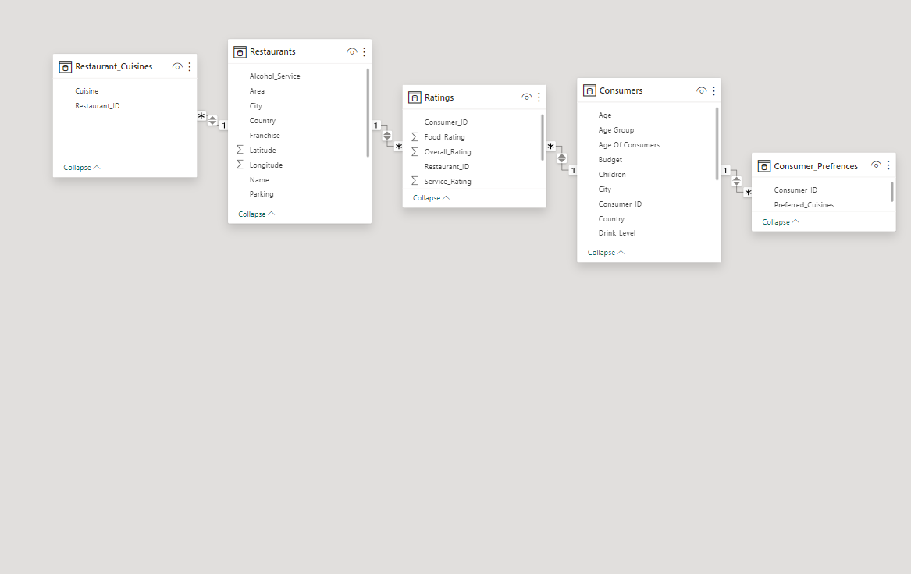
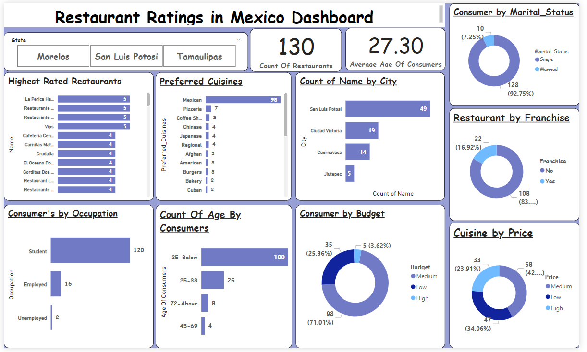
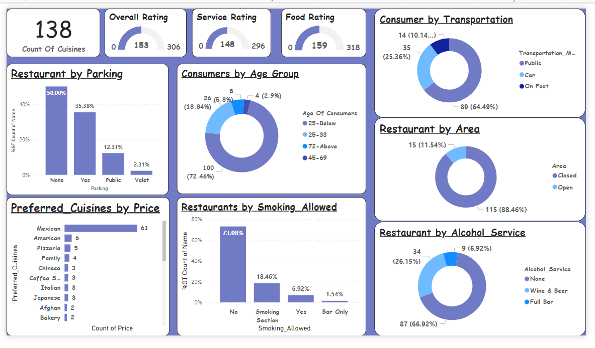

# Restaurant-Ratings-Project

## Introduction
This Power BI Project is aimed at analysing and drawing out meaningful insights from the **Restaurant Ratings** Data set which contains information about Restaurants in Mexico o. A customer survey was carried out in this city in 2012 to collate information about each restaurant, their cuisines, information about their consumers and the preferences of the consumers, the goal is identify data driven strategy and key areas of improvement, presented in a concise Report/Dashboard.

**_Disclaimer_**; _All data sets report do not represent any company,institution, or country but just a practice data set to demonstrate the capabilities of Power BI._

## Problem Statement
1. What can you learn from the highest rated restaurants? Do consumer preferences have an effect on ratings?
2. What are the consumer demographics? Does this indicate a bias in the data sample?
3. Are there any demand & supply gaps that you can exploit in the market?
4. If you were to invest in a restaurant, which characteristics would you be looking for?
   
## Power BI Concepts Applied
Removed Duplicates using Power Query
DAX Concept:
calculated columns,
Count,
Average,
Data Modelling: Star Schema.

## Data Modelling
I created relationship between all 5 tables which was adjusted to remove unwanted relationships with the required resulting in a schema model.

## Data Sourcing
The data set is gotten from Digitaley_Drive and are downloaded as an excel file and extracted in Power BI for cleaning, analysis and visualization.
It contains 5 tables/sheets:
1.Consumer Preferences with 138 rows and two columns
2.Consumers with 138 rows and 16 columns
3.Ratings with 138 rows and 5 columns
4.Restaurant_Cuisines with 112 rows 2 columns
5.Restaurants 130 rows and 13 columns

## Visualization
the report comprises of two pages

 | 

## Analysis
1(a&b).The highest rated restaurants are;

1.La perica Hamburguesa

2.Restaurant pueblo Bonito

3.Restaurante y pescaderia Tampico and

4.Vips with an overall rating of 5

The highest rated restaurants are from san luis potosi, cuidad Victoria and Cuernavaca which are the top 3 city's with most consumers. There are 130 restaurants in mexico.
now what is common among these restaurants is the fact that their most preferred cuisines is the Mexican cuisine, it also the most preferred cuisine by price.

2. The average age of consumers is **27**
 
#### Marital Status 
from the data set 128 consumers with a percentage of 92.75% are single while 10 of the consumers with a percentage of 7.25% are married.

#### Occupation
majority of consumers are students with a count of 120, followed by the employed  with a count of 16 and lastly the unemployed with a low count of 2.

**Ages** from 25 below are classified as young adults with 72.46% with a count of 100, Ages from 25-33 are grouped as youth with 18.25% and count of 26, Ages from 72 and above are grouped as Elderly with 5.8% with a count of 8, while Ages from 45-69 are considered middle-aged with 2.9% and a low count of 4.

 This shows that there was a bias in the data sample as age groups between 25 below, 26-33 and 45-69 were considered as kids
 
 
3.  #### Consumer Budget
99(71.01%) consumers had a medium budget,35(25.36%) Consumers had a low budget and 5(3.62%) had a high budget

#### Cuisines Price
33(25.36%) cuisines had a high price, 58(42.03%) had a medium price and 47(34.06%) had a low price.

When demand was too high this affected the sales even in the highest rated restaurants whereby cuisines are not available to the consumers causing a stalling point in the restaurants and poor first impressions.

#### Restauant by Franchise 
The count of Restaurant where franchising is allowed is 22(16.92%) while in 108(83.08%) it is not allowed.

#### Restaurant by Area
Restaurants by area that is closed is 115(88.46%) and 15(11.54%) are open for business.

#### Consumer by transportation
89(64.49%) of consumers use public transportation, 35(25.36%) use their personal cars and 14(10.14) means of transportation is by foot.

#### Restaurant By Alcohol Service
87(66.92%) restaurants have no alcohol service, 34(26.15%) has wine and bar services and 9(6.92%) of restaurants has a full bar.

#### Restaurant by parking
50% of restaurants have no parking areas, 35.38% of restaurants has a parking area, 12.31% of restaurants make use of public parking areas and 2.31% make use of valet services.

#### Restaurants by smoking Allowed
Smoking is not allowed in 73.08% of restaurants, there are smoking sections in 18.46% of restaurants, 6.92% Allow smoking and 1.54% has bar only.

4. ### Restaurant  Characteristics for Investing

4. (A) **Market size**
   it's expected to grow annually by magnificent (CAGR 2024-2030), Areas in north America are expected to grow considerable during the forcasted period, the use of large players in the region are likely to create ample growth oppurtunities in the market,the restaurant market is projected to reach multi million USD by 2030.

**Market Gap**
There could be issues in the market gap whereby there's a reduction in different unique menues in common dishes that stand out (e.g international cuisines).
**Product type**
Based on product types the market is categorized into the the below types that held the largest restaurants market share
1.fast food
2.fine dining
3.others

(B)**competitors**
There are lots of competitors in the restaurant biz; e.g starbucks, burger king,in-out burger and most especially chipotle which has a lot of variety of unique menus and their product offering is that they have gone into virtual branding franchises which is bound to hit 1 trillion global market by 2030.

(C)**Risk from Entry**
Insufficient cash flow; failing to raise sufficient capital can be a disaster, it requires a lot of time for a restaurant to establish itself in order to become profitable.

**Inadequate Marketing**; there is a huge problem with attracting more customers, it could be from the menu or décor.

### Market Profitability

(D) **Benefits of franchising**
Franchising offer the strong brand awareness and security.
the investor gets the right to use the restaurants name,trademark,branding and business model(Royalties from your licensed brand with an increased fee of 4% and 10%)

**Disadvantages of Franchising**; you will have to share control with other investors.
investors are 100% responsible if one/several restaurants don’t turn profit and investing entails time,capital and resources. 

### Thanks for reading.. 😄 

